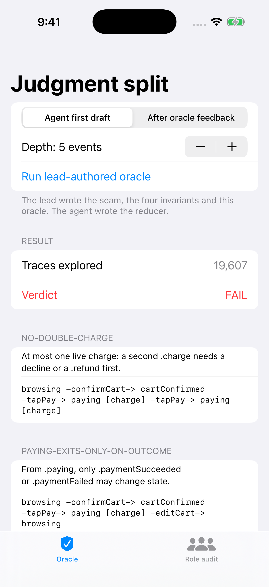
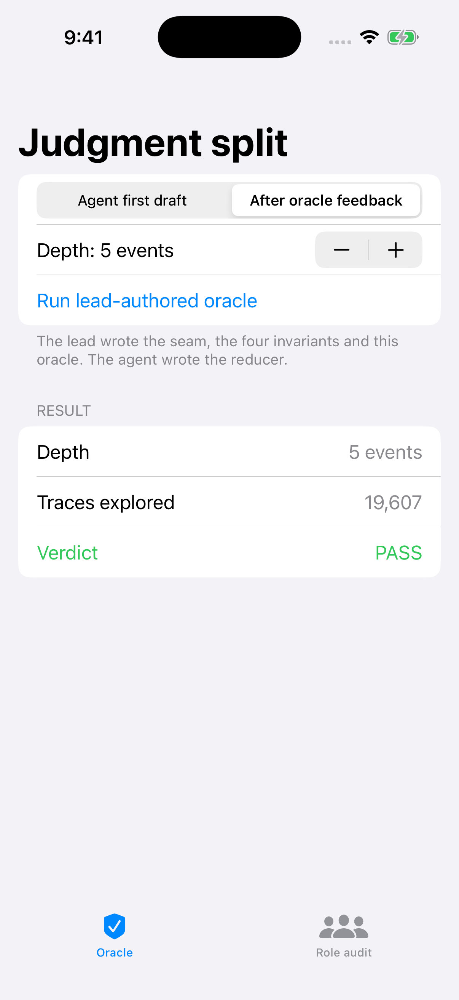
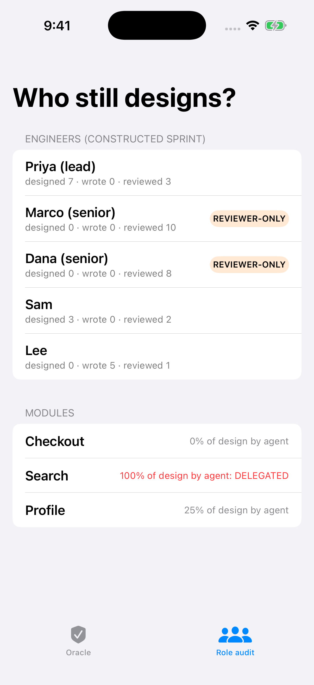

# JudgmentSplit: keep the design, delegate the typing

**Article:** [Your Seniors Aren't Tired of Coding Agents. They're Tired of Approving Designs They Didn't Make.](https://medium.com/@er.rajatlakhina/your-seniors-arent-tired-of-coding-agents-they-re-tired-of-approving-designs-they-didn-t-make-c3e1b1289133) (Medium)

A small Swift package and a runnable iOS demo for one argument: when a coding agent takes over a feature, the lead should keep the four artefacts that carry judgment (the **interface seam**, the **invariants**, the **pass/fail oracle** and the **failure-mode list**) and let the agent write the implementation against them. Hand the agent the whole ticket and your seniors are left approving code they no longer designed.

The package has two halves:

- **A checkout flow split along that line.** `CheckoutSeam.swift`, `Invariants.swift` and `Oracle.swift` are the lead-authored part. `AgentReducers.swift` holds two constructed agent implementations. The oracle drives an implementation through every event sequence up to a bounded depth (19,607 traces at depth 5) and reports the shortest counterexample for each broken invariant.
- **A role audit.** `RoleAudit` takes who authored and who reviewed which artefacts over a window and flags *reviewer-only* engineers (no judgment artefacts authored, at least N reviews) and *design-delegated* modules (more than half of the judgment artefacts agent-authored). Thresholds live in `AuditPolicy`, so they can be argued about in a PR.



## What the oracle catches

The agent's first draft handles every case and reads cleanly in review. It has two bugs that only appear as sequences:

```swift
// Bug 1: a second tap while the charge is in flight charges again.
case (.paying, .tapPay): return Transition(.paying, effects: [.charge])
// Bug 2: editing the cart abandons an in-flight charge.
case (.paying, .editCart): return Transition(.browsing)
```

Run at depth 5, the oracle reports three broken invariants from those two bugs, each with a three-event counterexample:

```text
no-double-charge                browsing -confirmCart-> cartConfirmed -tapPay-> paying [charge] -tapPay-> paying [charge]
charge-only-from-confirmed-cart (same trace)
paying-exits-only-on-outcome    browsing -confirmCart-> cartConfirmed -tapPay-> paying [charge] -editCart-> browsing
```

At depth 2 it reports nothing: a shallow oracle is a false sense of safety, and there is a test that says so.

```swift
let report = try Oracle().check(FirstDraftReducer(), depth: 5)
report.tracesExplored            // 19_607
report.violations.map(\.invariantID)
// ["no-double-charge", "paying-exits-only-on-outcome", "charge-only-from-confirmed-cart"]
```

The role audit on the constructed sample sprint flags two seniors as reviewer-only and the Search module as design-delegated.

| Fixed reducer passes | Role audit |
|---|---|
|  |  |

## How to run it

```bash
git clone https://github.com/rajatslakhina/judgment-split-article-demo.git
cd judgment-split-article-demo
open Demo.xcodeproj
```

Pick an iPhone Simulator, then Build & Run (⌘R). There is nothing else to set up: the app uses the package in the same repo through a local package reference.

To run the library tests on their own: `swift test`.

## Layout

```text
Package.swift                 library + tests only (no executable target)
Sources/JudgmentSplit/        CheckoutSeam, Invariants, Oracle (lead) · AgentReducers (agent) · RoleAudit, SampleTeam
Tests/JudgmentSplitTests/     13 XCTest cases
Demo.xcodeproj  Demo/         SwiftUI app: Oracle tab and Role audit tab
Scripts/simulator-screenshots.sh   CI script: build, install, launch on Simulator, screenshot
.github/workflows/ci.yml      swift build/test, then the Simulator run
```

## Verification status

- `swift build -Xswiftc -warnings-as-errors` and `swift test` pass locally on Swift 6.1.2 (Linux): **13 tests, 0 failures**.
- **Simulator run: done, in GitHub Actions on a macOS runner, not on my own Mac.** The `demo-on-simulator` job builds `Demo.xcodeproj` with `xcodebuild`, installs it on an iPhone Simulator, launches it three times with launch arguments (`-autorunOracle 0`, `-autorunOracle 1`, `-showAudit`) that select a tab or run the oracle through the same code path as the Run button, checks the app process is still alive 8 seconds after each launch, and commits the three screenshots in `Demo/Screenshots/`. The screenshots in `Demo/Screenshots/` are committed by the latest green run of that job on `main` (see the Actions tab; the commit is authored by github-actions[bot]). One earlier run failed with exit 141, a SIGPIPE from `launchctl list | grep -q` under `pipefail` in the screenshot script, not an app crash; the script now writes the process list to a file before grepping. Nobody tapped through the UI by hand.
- The sample team and both agent reducers are **constructed** for the demo. They are not data from a real team.

## Sources

- [Ask HN: Losing motivation to work in the IT field, need advice](https://news.ycombinator.com/item?id=49764727) (Hacker News, September 2026)
- [Senior developers report declining motivation as AI tools delegate away architectural and coding work](https://www.getreadyforagents.com/news/developer-motivation-loss-ai-delegation-architecture/) (Agentic Ready, September 2026)

MIT licensed.
